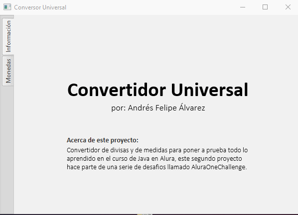

# Conversor de Monedas
Segundo desafio de Oracle One dictado por Alura.
  

## Acerca de este proyecto
Convertidor de divisas y de medidas para poner a prueba todo lo aprendido en el curso de Java en Alura, este segundo proyecto hace parte de una serie de desafios llamado AluraOneChallenge, su nombre internto es Conversor Universal, ya que esta abierto para que incluya otros tipos de convertidores tales como de medidas y tiempo.
  

## Tecnologia utilizada
Java, JavaFX y CSS
 
 

## Interfaz del software

  

## Lanzamiento
21/08/2023 - Primera compilación a .jar
  

### Requisitos
[Java](https://www.java.com/en/download/)
